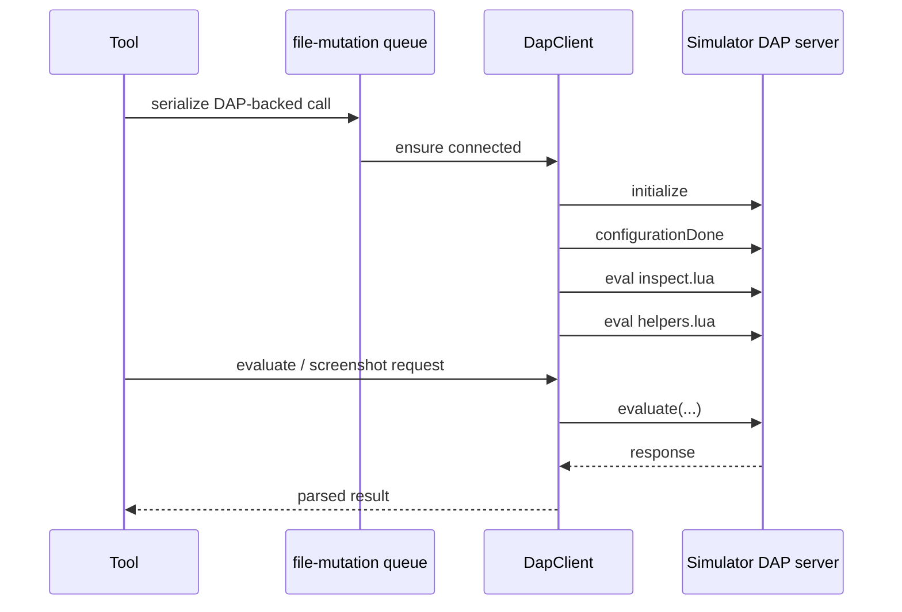

# DAP protocol

This document describes how `pi-playdate` uses the Playdate Simulator's Debug Adapter Protocol (DAP).

## Scope

DAP is used for Lua-game-only features:

- `playdate_screenshot`
- `playdate_sim_input`
- `playdate_sim_eval`
- `playdate_sim_state`

C games do not expose the same Lua DAP surface.

## Endpoint

- TCP port: `55934`
- Client: `src/lib/dap.ts`

The extension opens a plain TCP socket and speaks DAP framing directly.

## Request flow

`src/lib/dap.ts` does:

1. Connect to `localhost:55934`
2. Send `initialize`
3. Send `configurationDone`
4. Inject helper Lua code (`inspect.lua` + `helpers.lua`)
5. Serve evaluate/screenshot helpers on top of the live connection



## Message framing

DAP uses:

```text
Content-Length: <bytes>\r\n
\r\n
<json body>
```

`dap.ts` parses frames manually and matches responses by `request_seq`.

## Why calls are serialized

DAP-backed tools share one mutable connection and one REPL context. If multiple tool calls try to inject helpers, evaluate code, or capture screenshots in parallel, requests can interleave in unsafe ways.

So these tools are serialized with a shared sentinel key in `src/lib/dap-queue.ts`.

That currently covers:

- `playdate_screenshot`
- `playdate_sim_input`
- `playdate_sim_eval`
- `playdate_sim_state`
- crank/accel tools too, because they often pair with state reads and we want a single ordered control path

## Screenshot method

`playdate_screenshot` uses Lua evaluation and calls:

```lua
playdate.simulator.writeToFile(playdate.graphics.getDisplayImage(), outputPath)
```

That gives a clean game framebuffer image without OS window chrome.

## Input method

`playdate_sim_input` currently uses direct Lua callbacks for D-pad / A / B. It does not do OS keyboard automation.

That is separate from native crank/accelerometer control.

## State method

`playdate_sim_state` asks Lua to call `__pd_state()` and parses a compact string result into structured tool details.

That gives a better typed API for common hardware state than forcing the model to use raw eval calls.
