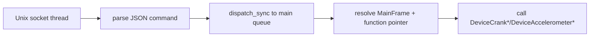

# Injected dylib

This document describes the macOS-only simulator control path used by `playdate_sim_crank`, `playdate_sim_accel`, and the native menu path in `playdate_sim_input`.

## Why it exists

DAP is good for Lua evaluation, screenshots, and direct Lua callback input, but it does not expose real simulator crank or accelerometer control. We wanted real simulator/device-equivalent state, not fake Lua callbacks.

The final design is:

1. `playdate-simctl` injects `playdate-sim-agent.dylib` into the running Playdate Simulator process.
2. The injected agent starts a Unix socket server inside the simulator process.
3. The CLI sends JSON commands over that socket.
4. The agent calls internal simulator functions on the main thread.

This avoids repeated LLDB attach/detach cycles, which visibly freeze the simulator.

## Files

- `native/playdate-sim-agent.c`
- `native/playdate-simctl.swift`
- `src/lib/sim-control.ts`

## Injection flow

On first use per simulator PID:

1. `src/lib/sim-control.ts` calls `bin/playdate-simctl inject --pid <pid>`.
2. `playdate-simctl` checks whether `/tmp/pi-playdate-agent-<pid>.sock` is already reachable.
3. If not, it runs LLDB once and executes `dlopen()` inside the target process.
4. The dylib constructor runs and starts a detached pthread with a Unix socket server.
5. Subsequent crank/accel/menu calls use only socket IPC.

```mermaid
flowchart TD
    TS[TypeScript tool\nsim-control.ts] --> CLI[playdate-simctl inject]
    CLI --> SOCKCHK{socket reachable?}
    SOCKCHK -- yes --> READY[agent ready]
    SOCKCHK -- no --> LLDB[LLDB attach + dlopen]
    LLDB --> DYLIB[playdate-sim-agent.dylib loaded]
    DYLIB --> CTOR[constructor runs]
    CTOR --> THREAD[detached pthread server]
    THREAD --> SOCK[/tmp/pi-playdate-agent-PID.sock]
    SOCK --> READY
    READY --> CMDS[crank/accel/menu JSON commands]
```

## What the dylib calls

The dylib knows a small set of simulator offsets:

- `MAIN_FRAME_GLOBAL`
- `DEVICE_CRANK_DOCKED`
- `DEVICE_CRANK_CHANGED`
- `DEVICE_ACCEL_CHANGED`

It computes runtime addresses using `_dyld_get_image_vmaddr_slide(0)` and then calls those methods through the `MainFrame` object.

## Main-thread requirement

The first agent attempt crashed because simulator UI code was being touched from the socket thread. The current implementation wraps calls in `dispatch_sync(dispatch_get_main_queue(), ...)`.

That requirement is important: the injected agent must call simulator/UI-affecting code on the main thread.



## Scope

Current dylib capabilities:

- crank dock / undock
- crank angle changes
- accelerometer x/y/z changes
- system menu open via `pd_enterMenu()`

Button injection is still handled separately via DAP-backed Lua callbacks.

## Constraints

- macOS only
- runtime-only modification; no patching simulator binaries on disk
- build native artifacts outside Nix shell with system `swiftc` / `clang`
- injected dylib is not part of end-user docs; this is internal implementation detail
